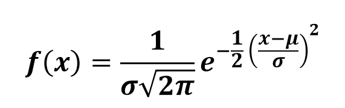
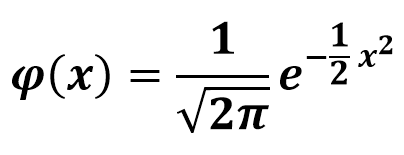
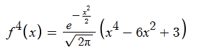

# Normal(Gaussian) Distribution
In probability theory, a normal (or **Gaussian** or **Gauss** or **Laplace–Gauss**) distribution is a type of continuous probability distribution for a real-valued random variable. The general form of its probability density function is<br />
<br />
The parameter &mu; is the mean or expectation of the distribution, while the parameter σ is its standard deviation.<br />The variance of the distribution is &sigma;<sup>2</sup>. A random variable with a Gaussian distribution is said to be **normally distributed**.			
## Standard Normal Distribution
The simplest case of a normal distribution is known as the standard normal distribution. This is a special case when &mu; = 0 and &sigma; = 1, and it is described by this probability density function.<br />		
	
## Cumulative Distribution Function
The cumulative distribution function (CDF) of the standard normal distribution, usually denoted with the capital Greek letter &Phi;, is the integral<br />
<br />		
We use **Simpsons** 1/3rd rule to do the integration.Further to eliminate infinity term we can use the definition of error function to write<br />
  where 

## Simpson's 1/3 rule
Simpson's rule is one of the numerical method to compute the integration of a function over a finite interval. The most basic of these rules states.<br />
<br />					
Suppose that the interval [a,b] is split up into n sub-intervals, with n an even number. Then, the composite Simpson's rule is given by<br />

<br />

where x<sub>j</sub> =a+jh for j=0,1...n-1,n with h=(b-a)/n
### Error analysis
In general the error term in the simpson's 1/3rd rule is<br />
<br />
where h is the step size.<br />
For the Gaussian Function the error term comes out to be<br />	
<br />
it has a golbal maxima at 0. During the computation of integration our interval always contains 0 because
**&Phi;(x)= 0.5(1+erf(x))** and erf(x) contains 0 in its interval.<br />
Substituting all the values h=0.01, f<sup>(4)</sup>(x=0) we get the error ≈ 2e-10
## Simulation and implementation
For the numerical computation purposes python's math library was used.<br />
And for the interface python's **Tkinter** which is a de-facto standard GUI package.<br />		
There are two ways to run the script<br />	
Method 1:  Download the main.exe and run executable file<br />				
Method 2(for users with python):<br />		
a) Download and install python3:<br />		
b) Clone the directory<br />
run ```git clone https://github.com/susmitmishra125/Normal-Distribution-using-GUI.git```<br />			
c) Install requirements:<br />
Locate the directory you cloned to on terminal and run ```pip3 install -f requirements.txt```<br />
d) Run ```python main.py``` in the same directory


